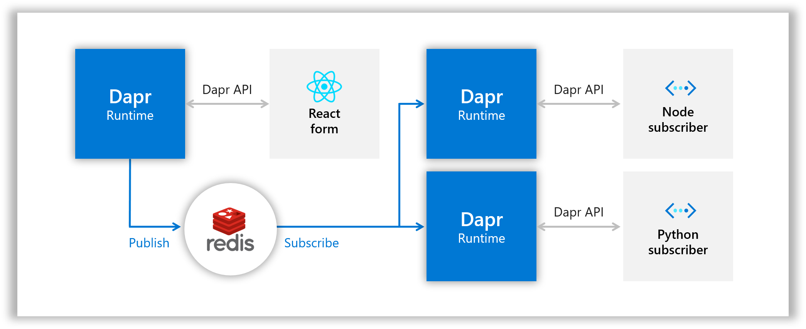

# Dapr Quickstart

Lorem ipsum dolor sit amet, consectetur adipiscing elit. Donec tempor sapien nec purus volutpat aliquam. Vivamus pretium dapibus consequat. Vestibulum tempus magna mauris, mattis rutrum elit vehicula ac. Praesent posuere, lectus sed fermentum faucibus, nibh augue lobortis ipsum, at auctor nulla ligula et nisi. Nulla sapien ligula, sagittis id justo sed, laoreet volutpat mi. Morbi ac efficitur libero, ut pulvinar leo. Fusce accumsan ultrices diam, eget viverra ligula bibendum egestas.

* **Date:** 8th November 2021
* **Squad:** Cloud Native
* **Duration:** 30 minutes

## Getting Started

For this demo we will be using the Dapr project's [quickstarts](https://github.com/dapr/quickstarts) repo. We'll focus on the [pub-sub](https://github.com/dapr/quickstarts/tree/master/pub-sub) quickstart, which demonstrates how to use Dapr to enable pub-sub applications using Redis as a pub-sub component.

1. In a new tab, navigate to https://github.com/dapr/quickstarts.

1. If you would like to jump in right away by using GitHub Codespaces, you can click on "Code" in this repo, select "Codespaces" and click "New Codespace", which will let you get started right away with ```dapr init```.

    > GitHub Codespaces will provide you a Visual Studio Code based editor backed by high performance VMs in the cloud. It will take a moment for GitHub to create your dev space. This does the following:
    >
    > - Build a container image based on the [Dockerfile](https://github.com/dapr/quickstarts/blob/v1.4.0/.devcontainer/Dockerfile). 
    > - Create a dev container based on [devcontainer.json](https://github.com/dapr/quickstarts/blob/v1.4.0/.devcontainer/devcontainer.json).
    > - Configure this container, and your dev environment as per the provided config. 
    > If you don't have access to GitHub Codespaces, follow the guide here to get started using [Dev Containers](https://code.visualstudio.com/docs/remote/containers) locally.  

1. Once your Codespace is ready. Open the Terminal and run ```dapr init```. Dapr runs as a sidecar alongside your application, and in self-hosted mode this means it is a process on your local machine. Therefore, initializing Dapr includes fetching the Dapr sidecar binaries and installing them locally. Find out more [here](https://docs.dapr.io/getting-started/install-dapr-selfhost/).

## Exploring Pub-Sub

In this quickstart, you'll create a publisher microservice and two subscriber microservices to demonstrate how Dapr enables a publish-subcribe pattern. The publisher will generate messages of a specific topic, while subscribers will listen for messages of specific topics.

Visit [this](https://docs.dapr.io/developing-applications/building-blocks/pubsub/) link for more information about Dapr and Pub-Sub.

This quickstart includes one publisher:

- React front-end message generator

And two subscribers: 
 
- Node.js subscriber
- Python subscriber

Dapr uses pluggable message buses to enable pub-sub, and delivers messages to subscribers in a [Cloud Events](https://github.com/cloudevents/spec) compliant message envelope. in this case you'll use Redis Streams. The following architecture diagram illustrates how components interconnect locally:



## Acknowledgements

* This demo is based on Dapr's [Pub-Sub quickstart](https://github.com/dapr/quickstarts/tree/v1.4.0/pub-sub).

## Contributors

* Kevin Harris - kevin.harris@microsoft.com
* Liam Moat - liam.moat@microsoft.com
* Anu Bhattacharya - anulekha.bhattacharya@microsoft.com
* Gordon Byers - gobyers@microsoft.com
